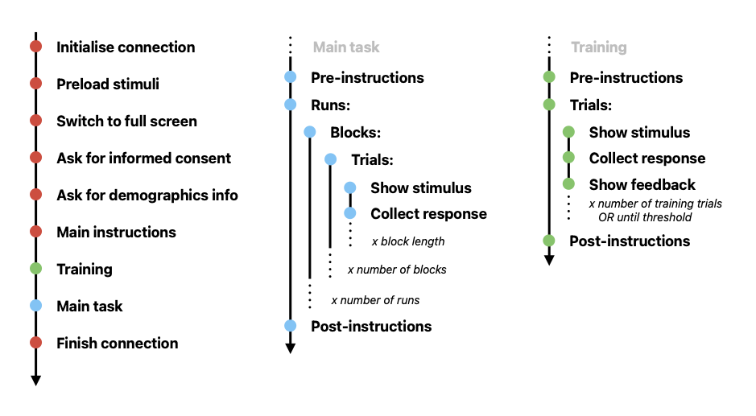

# Classification task template
---

This is a template for a jsPsych-based online categorisation task. It is made to be a lightweight, easy to amend script that you can easily use for your own experiment. The task implemented here is an **animacy** task, where participants classify images as _inanimate_ or _animate_.

### Directory structure

```
.
├── data
├── demographics
├── informed_consent
├── instructions
│   └── instruction_images
├── readme_files
├── masks
├── stimuli
├── training_masks
└── training_stimuli
```

### About the different folders

- `data` is where pavlovia automatically sends the collected data.
- `demographics` contains an external `.js` file with the content of the quick demographics survey to appear at the start of the experiment.
- `informed consent` contains an external `.js` file with the content of the informed consent participants will accept at the start of the experiment, alongside a `.css` file to determine some visual features of the consent form.
- `instructions` contains an external `.js` file containing instructions to be displayed at different moments of the experiment, and serves to de-clutter the main script. It also contains a `.css` file to style some visual elements of the instructions, and some images in `instruction_images` to illustrate things.
- `stimuli` contains your main task images.
- `training_stimuli` contains your training images.
- `readme_files` contains illustrations for this readme document.


***Note***.The extra file *jspsych-7-pavlovia-2021.12.js* comes from this [gitlab repository](https://gitlab.pavlovia.org/shir/jsPsych_SimpleReactionTime/blob/master/jspsych-7-pavlovia-2021.12.js) and is the only way around using the readily available *jspsych-7-pavlovia-2022.1.1.js*
which faces consistent issues with terminating the pavlovia connection. It's a temporary solution.


### Parameters

Here are the parameters to set before running your script:

 - `exp_online` determines whether your script tries to connect to Pavlovia.
 - `exp_fullscreen` determines whether to run the experiment in full screen.
 - `ask_informed_consent` should participants are presented with an informed consent to sign.
 - `ask_demographics` should participants are asked for some demographic information.
 - `exp_instructions` show instructions at the start of the experiment or not
 - `exp_training` play training trials at the start of the experiment.

 - `n_runs` number of times all the trial are shown. Each run is divided in n_bocks.
 - `n_blocks` how many blocks a full run is divided into, with breaks in between each block.
 - `img_width` commented out by default, uncomment to constrain the width of your images.
 - `img_height` commented out by default, uncomment to constrain the height of your images.
 - `jitter_duration` how long the jitter can be, from 0 to x.
 - `fixation_duration` pre-stimulus fixation duration (ms).
 - `image_duration` target stimulus presentation duration (ms).
 - `training_threshold` successive correct trials needed to pass training.

 - `response_labels` what are the participants responding?
 - `response_buttons` declare the keys to use to respond.

 - `debugging_mode` turn this on to make the experiment much shorter (useful for debugging.)
 - `debugging_length` how many trials of training and main task are played in debug mode.


### Experiment timeline

When all events are turned on, here is what the timeline of a full experiment looks like:

1. The connection is initialised with **jsPsych** and **Pavlovia**.
2. All file names contained in the stimulus list are preloaded.
3. The experiment starts in full screen.
4. The _informed consent_ form is presented and signed.
5. The _demographics questionaire_ is presented and filled.
6. The _main instructions_ are displayed.
7. **Training** starts:
    - Training instructions come on screen.
    - Training trials are played
    - Training finishes when a threshold is reached or all the training stimuli have been presented.
    - Post-training instructions come on screen.
8. **Main task** starts:
    - Pre-task instructions are shown.
    - Runs follow each other. Each run is divided into blocks, with breaks in between.
    - A quick post-task debriefing is shown.
9. The connection is closed with Pavlovia.




### Stimulus list


To have jsPsych read and use your files, you need to refer to them in your main script. There are two ways of doing so.

1. If you don't have a lot of images, it's probably the easiest to list them inside your `index.html`, like this:
```let stimuli = ['./stimuli/image1.png, './stimuli/image2.png', …]```
2. In most cases, if you have a lot of images and/or if you want a cleaner script, your can make use of an external `.js` file. This is in use by default in this template. Such a file should contain a list of stimuli like this:
```
var stimuli = [
  {
    "filename": "./stimuli/image1.png"
  },
  {
    "filename": "./stimuli/image2.png"
  },
  ...
 ]
```

You can create this external `.js` file as you please. One way to go about it is illustrated in `make_stim_list.py`, a python script that will take the stimuli you uploaded in the stimuli folders and automatically create an external `.js` list for you (see `stimuli.js`).